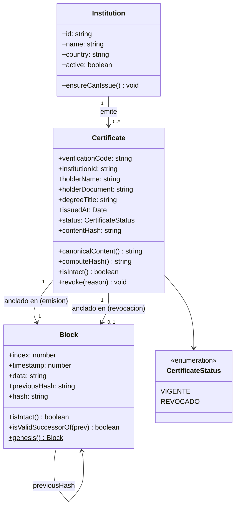
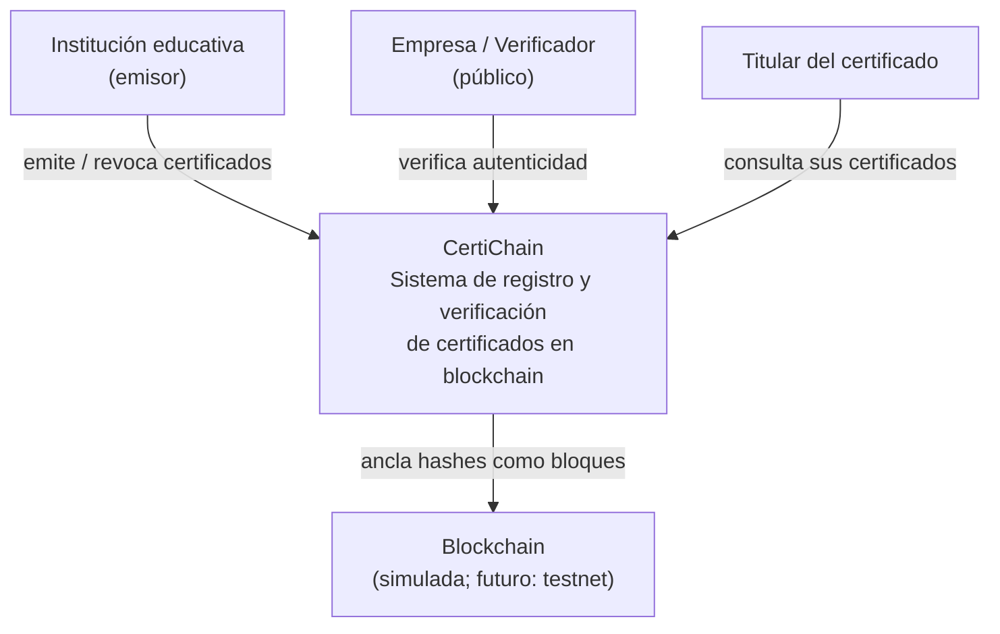
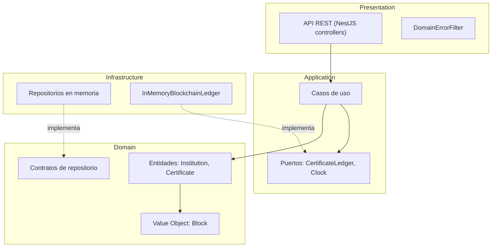
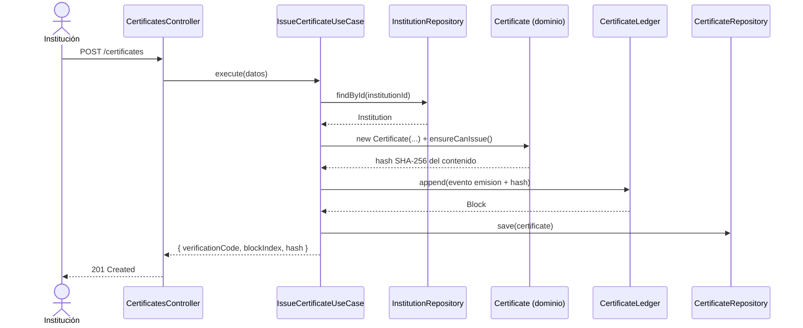
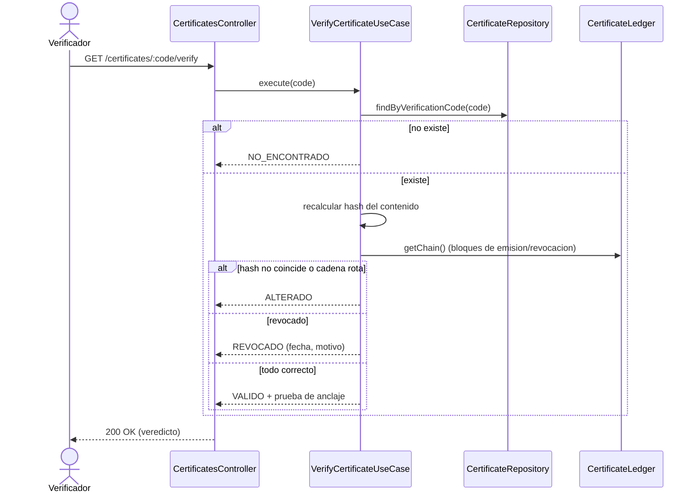
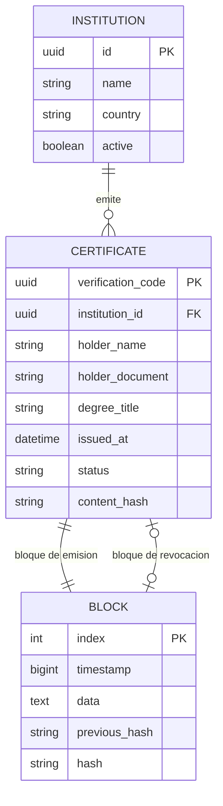

# CertiChain — Sistema de Registro y Verificación de Certificados Académicos en Blockchain

**Documento de Análisis y Diseño de Software**

| | |
|---|---|
| **Curso** | Arquitectura de Software |
| **Arquitectura aplicada** | Onion Architecture |
| **Stack** | TypeScript + NestJS |
| **Equipo** | Steve Gómez, [Integrante 2], [Integrante 3] |
| **Fecha** | Julio de 2026 |

---

## 1. Introducción

### 1.1 Contexto

Las instituciones educativas —universidades, institutos y centros de formación— emiten cada año miles de certificados, diplomas y constancias de estudios. En la mayoría de los casos, estos documentos se entregan en papel o como archivos PDF simples, sin ningún mecanismo técnico que permita a un tercero comprobar su autenticidad de forma inmediata.

Esta situación genera un problema real y creciente: la **falsificación de títulos y certificados académicos**. Hoy, cuando una empresa necesita validar el certificado de un postulante, debe contactar directamente a la institución emisora, un proceso lento, costoso y que depende por completo de la disponibilidad de dicha institución; si esta cierra, cambia de sistema o simplemente no responde, la verificación se vuelve imposible. El verificador está obligado a confiar en un intermediario.

La tecnología **blockchain** ofrece una respuesta directa a este problema gracias a dos propiedades: la **inmutabilidad** (lo registrado no puede alterarse sin romper la cadena) y la **verificación descentralizada** (no se necesita pedir permiso ni consultar al emisor). Si en el momento de la emisión se calcula la huella digital (hash) del certificado y se ancla como un bloque de la cadena, cualquier persona o empresa puede, en segundos, comprobar que el documento existe, que no ha sido modificado y que no ha sido revocado.

El proyecto se desarrolla aplicando la **Arquitectura Onion**, especialmente adecuada porque las reglas del negocio —qué es un certificado válido, quién puede emitirlo, cuándo se revoca, cómo se comprueba su integridad— son independientes de la tecnología: la blockchain es un **detalle de infraestructura intercambiable**, que hoy se implementa como una cadena simulada y mañana podría anclarse a una red pública de pruebas (testnet) sin modificar el núcleo del sistema.

### 1.2 Objetivos

**Objetivo general**

Desarrollar un sistema de registro y verificación de certificados académicos anclados en una cadena de bloques, aplicando la Arquitectura Onion de modo que el dominio del negocio permanezca independiente de los frameworks, la base de datos y la propia blockchain.

**Objetivos específicos**

| # | Objetivo |
|---|----------|
| OE-1 | Permitir que las instituciones registradas emitan certificados cuya huella digital (hash SHA-256) quede anclada como un bloque inmutable de la cadena |
| OE-2 | Ofrecer a cualquier tercero un mecanismo público de verificación de autenticidad e integridad que no dependa de la institución emisora |
| OE-3 | Soportar la revocación de certificados dejando rastro auditable e inmutable en la cadena |
| OE-4 | Implementar la solución en cuatro capas concéntricas (Domain, Application, Infrastructure, Presentation) con dependencias que apunten siempre hacia el centro |
| OE-5 | Garantizar la calidad mediante pruebas unitarias del dominio y casos de uso, y pruebas de extremo a extremo del flujo completo |
| OE-6 | Exponer la funcionalidad a través de una API REST construida con TypeScript y NestJS |

### 1.3 Alcance

**El sistema incluye:**

- Registro de instituciones educativas emisoras.
- Emisión de certificados académicos (diplomas, constancias, títulos) con cálculo de hash SHA-256 y anclaje como bloque de la cadena.
- Verificación pública de un certificado: dado su código de verificación, el sistema responde si es auténtico, íntegro y vigente (o revocado).
- Revocación de certificados por parte de la institución emisora, registrada también como bloque inmutable.
- Auditoría de la integridad de la cadena completa: cualquier alteración de un bloque es detectada y localizada.
- API REST con los casos de uso anteriores, bajo Arquitectura Onion.
- Blockchain simulada (bloques encadenados por hash) detrás de un contrato (puerto) que permite reemplazarla por una red real.

**El sistema NO incluye (fuera del alcance de esta versión):**

- Integración con una blockchain pública real (Ethereum, Polygon u otra testnet); prevista como evolución gracias al puerto definido.
- Gestión documental del archivo del certificado (PDF/imagen); el sistema ancla y verifica la huella, no custodia el documento.
- Firma digital certificada ni integración con registros oficiales de grados y títulos (p. ej., SUNEDU).
- Interfaz gráfica web o móvil; la interacción se realiza vía API REST.
- Gestión avanzada de usuarios, roles y autenticación federada.

---

## 2. Análisis del negocio

### 2.1 Stakeholders

| Stakeholder | Rol | Interés principal |
|-------------|-----|-------------------|
| **Institución educativa** | Emisor | Emitir certificados imposibles de falsificar y reducir la carga operativa de atender solicitudes de verificación |
| **Titular (egresado/estudiante)** | Beneficiario | Poseer un certificado verificable al instante ante cualquier empleador, sin trámites |
| **Verificador (empresa/reclutador/otra institución)** | Consumidor | Comprobar en segundos la autenticidad de un certificado sin depender del emisor |
| **Administrador del sistema** | Operador | Mantener la plataforma disponible y auditar la integridad de la cadena |
| **Equipo de desarrollo** | Constructor | Implementar y mantener el sistema demostrando la Arquitectura Onion |
| **Docente del curso** | Evaluador | Verificar la correcta aplicación de la arquitectura y su justificación |

### 2.2 Glosario

| Término | Definición |
|---------|------------|
| **Blockchain (cadena de bloques)** | Estructura de datos donde cada bloque guarda el hash del bloque anterior, haciendo el historial inmutable |
| **Bloque** | Unidad de la cadena: índice, timestamp, datos (payload), hash propio y hash del bloque anterior |
| **Bloque génesis** | Primer bloque de la cadena, idéntico y conocido por todos; no contiene datos de negocio |
| **Hash (SHA-256)** | Huella digital de un contenido: cualquier cambio en el contenido produce un hash completamente distinto |
| **Anclar (anchor)** | Registrar el hash de un documento como bloque de la cadena para probar su existencia e integridad |
| **Ledger** | "Libro mayor": el registro completo de bloques; en este proyecto, el puerto `CertificateLedger` |
| **Código de verificación** | Identificador único y público de un certificado, con el cual cualquiera consulta su validez |
| **Revocación** | Acto de invalidar un certificado emitido; no borra el bloque original, agrega un bloque de revocación |
| **Emisión** | Acto de crear un certificado y anclar su hash en la cadena |
| **Integridad de cadena** | Propiedad que se cumple cuando todo bloque encadena correctamente con su anterior y su hash coincide con su contenido |

### 2.3 Reglas de negocio

| ID | Regla |
|----|-------|
| RN-01 | Solo una institución **registrada y activa** puede emitir certificados |
| RN-02 | Todo certificado pertenece a exactamente una institución emisora y un titular |
| RN-03 | Al emitirse, el certificado recibe un **código de verificación único** y su hash SHA-256 se ancla como bloque en la cadena |
| RN-04 | Un certificado solo puede ser revocado por **su institución emisora** |
| RN-05 | Un certificado revocado **no puede volver a activarse** ni revocarse dos veces |
| RN-06 | La revocación **no elimina** el bloque de emisión: se registra como un **nuevo bloque** que referencia al certificado |
| RN-07 | La verificación es **pública**: no requiere autenticación ni autorización de la institución emisora |
| RN-08 | Un certificado es **válido** solo si: (a) existe, (b) su hash coincide con el contenido registrado, (c) la cadena está íntegra y (d) no existe bloque de revocación posterior |
| RN-09 | Los bloques de la cadena son **inmutables**: cualquier alteración debe ser detectable en la auditoría |
| RN-10 | Los datos personales del titular se limitan al mínimo necesario (nombre y documento); el bloque ancla el hash, no los datos sensibles del documento original |

### 2.4 Supuestos y restricciones

**Supuestos**

- Las instituciones actúan de buena fe al registrar los datos del certificado (el sistema garantiza integridad *post-emisión*, no la veracidad del contenido original).
- El verificador posee el código de verificación (impreso en el certificado o provisto por el titular).
- Una sola instancia del sistema opera la cadena en esta versión (no hay consenso distribuido).

**Restricciones**

- **Académica**: el proyecto debe demostrar la Arquitectura Onion; las dependencias solo apuntan hacia adentro.
- **Tecnológica**: TypeScript + NestJS; blockchain simulada en la capa de infraestructura detrás del puerto `CertificateLedger`.
- **De tiempo**: el desarrollo se ajusta al calendario del curso (julio 2026); las evoluciones (testnet real, frontend) quedan fuera.
- **De persistencia**: la versión inicial usa repositorios en memoria; la migración a SQLite/PostgreSQL solo debe requerir nuevas implementaciones de los contratos ya definidos.

---

## 3. Análisis funcional

### 3.1 Historias de usuario

| ID | Historia |
|----|----------|
| HU-01 | **Como** administrador, **quiero** registrar una institución educativa, **para** que pueda emitir certificados en la plataforma |
| HU-02 | **Como** institución registrada, **quiero** emitir un certificado académico para un titular, **para** que quede anclado de forma inmutable en la blockchain |
| HU-03 | **Como** empresa verificadora, **quiero** consultar un certificado por su código de verificación, **para** saber al instante si es auténtico, íntegro y vigente |
| HU-04 | **Como** institución emisora, **quiero** revocar un certificado emitido por error, **para** que cualquier verificación futura lo muestre como no vigente |
| HU-05 | **Como** auditor, **quiero** verificar la integridad de toda la cadena, **para** garantizar que ningún registro histórico fue alterado |
| HU-06 | **Como** titular, **quiero** listar los certificados emitidos a mi nombre, **para** compartir sus códigos de verificación con quien los solicite |

### 3.2 Criterios de aceptación

**HU-02 — Emitir certificado**
- **Dado** una institución registrada y activa, **cuando** emite un certificado con los datos del titular y el título otorgado, **entonces** el sistema genera un código de verificación único, calcula el hash SHA-256 y lo ancla como nuevo bloque, devolviendo código, hash y número de bloque.
- **Dado** una institución inexistente o inactiva, **cuando** intenta emitir, **entonces** el sistema rechaza la operación (RN-01).

**HU-03 — Verificar certificado**
- **Dado** un código de verificación válido de un certificado vigente e íntegro, **cuando** se consulta, **entonces** el sistema responde `VALIDO` con los datos del certificado y la prueba de anclaje (bloque y hash).
- **Dado** un código inexistente, **entonces** responde `NO_ENCONTRADO`.
- **Dado** un certificado cuyo contenido no coincide con el hash anclado, **entonces** responde `ALTERADO`.
- **Dado** un certificado revocado, **entonces** responde `REVOCADO` indicando fecha y motivo.

**HU-04 — Revocar certificado**
- **Dado** un certificado vigente, **cuando** su institución emisora lo revoca indicando un motivo, **entonces** se agrega un bloque de revocación y las verificaciones futuras responden `REVOCADO`.
- **Dado** un certificado ya revocado, **cuando** se intenta revocar de nuevo, **entonces** el sistema rechaza la operación (RN-05).
- **Dado** una institución distinta a la emisora, **cuando** intenta revocar, **entonces** el sistema rechaza la operación (RN-04).

**HU-05 — Auditar cadena**
- **Dado** una cadena sin alteraciones, **cuando** se audita, **entonces** responde `valida: true` con el total de bloques.
- **Dado** un bloque alterado manualmente, **cuando** se audita, **entonces** responde `valida: false` señalando el índice del bloque corrupto.

### 3.3 Requisitos funcionales

| ID | Requisito | HU | Prioridad |
|----|-----------|-----|-----------|
| RF-01 | El sistema permitirá registrar instituciones con nombre y país | HU-01 | Alta |
| RF-02 | El sistema permitirá emitir certificados con: titular (nombre, documento), título otorgado y fecha de emisión | HU-02 | Alta |
| RF-03 | Al emitir, el sistema calculará el hash SHA-256 del contenido del certificado y lo anclará como bloque | HU-02 | Alta |
| RF-04 | El sistema generará un código de verificación único por certificado | HU-02 | Alta |
| RF-05 | El sistema permitirá verificar un certificado por código, respondiendo VALIDO, REVOCADO, ALTERADO o NO_ENCONTRADO | HU-03 | Alta |
| RF-06 | El sistema permitirá revocar un certificado (solo su emisor), registrando motivo y fecha como nuevo bloque | HU-04 | Alta |
| RF-07 | El sistema permitirá auditar la integridad de la cadena completa | HU-05 | Alta |
| RF-08 | El sistema permitirá consultar la cadena de bloques completa (transparencia) | HU-05 | Media |
| RF-09 | El sistema permitirá listar los certificados de un titular por su documento | HU-06 | Media |

### 3.4 Requisitos no funcionales

| ID | Categoría | Requisito |
|----|-----------|-----------|
| RNF-01 | Arquitectura | El código se organizará en 4 capas Onion; la capa Domain no importará nada de Application, Infrastructure, Presentation ni NestJS |
| RNF-02 | Mantenibilidad | Reemplazar la blockchain simulada o la persistencia solo requerirá nuevas implementaciones de los contratos, sin tocar Domain/Application |
| RNF-03 | Testabilidad | Dominio y casos de uso serán probables sin base de datos, sin HTTP y sin framework (fakes en memoria) |
| RNF-04 | Integridad | Toda alteración de un bloque registrado será detectable en la auditoría (hash SHA-256 encadenado) |
| RNF-05 | Disponibilidad de verificación | La verificación será pública, sin autenticación |
| RNF-06 | Rendimiento | La verificación de un certificado responderá en < 1 s con cadenas de hasta 10 000 bloques |
| RNF-07 | Privacidad | Los bloques no contendrán más datos personales que los mínimos del certificado (RN-10) |
| RNF-08 | Portabilidad | El sistema correrá en Node.js ≥ 22 en cualquier SO, sin dependencias nativas |

### 3.5 Casos de uso

| ID | Caso de uso | Actor | Precondición | Flujo principal |
|----|-------------|-------|--------------|-----------------|
| CU-01 | Registrar institución | Administrador | — | Ingresa datos → sistema valida y persiste → retorna id |
| CU-02 | Emitir certificado | Institución | Institución activa | Ingresa datos del certificado → sistema valida (RN-01, RN-02) → calcula hash → ancla bloque → retorna código de verificación |
| CU-03 | Verificar certificado | Verificador (público) | — | Ingresa código → sistema busca certificado, recalcula hash, revisa revocaciones y cadena → retorna veredicto |
| CU-04 | Revocar certificado | Institución emisora | Certificado vigente | Indica código y motivo → sistema valida (RN-04, RN-05) → ancla bloque de revocación |
| CU-05 | Auditar cadena | Auditor (público) | — | Solicita auditoría → sistema recorre la cadena validando encadenamiento e integridad → retorna resultado |
| CU-06 | Listar certificados de titular | Titular | — | Ingresa documento → sistema retorna certificados con su estado |

---

## 4. Modelado del dominio

### 4.1 Entidades principales

| Entidad / VO | Tipo | Responsabilidad |
|--------------|------|-----------------|
| **Institution** | Entidad (raíz de agregado) | Institución emisora; sabe si está activa y si puede emitir |
| **Certificate** | Entidad (raíz de agregado) | El certificado académico; conoce su contenido canónico, calcula su hash, sabe si está vigente y hace cumplir las reglas de revocación |
| **Block** | Value Object | Bloque inmutable de la cadena; hash SHA-256 derivado del contenido; valida su encadenamiento con el bloque anterior |
| **CertificateStatus** | Enum de dominio | `VIGENTE` \| `REVOCADO` |
| **VerificationResult** | Value Object | Veredicto de una verificación: `VALIDO`, `REVOCADO`, `ALTERADO`, `NO_ENCONTRADO` + evidencia |

### 4.2 Relaciones

- Una **Institution** emite `1..*` **Certificate**; un **Certificate** pertenece a exactamente **una** Institution (RN-02).
- Un **Certificate** queda anclado en exactamente **un** Block de emisión, y opcionalmente **un** Block de revocación (RN-06).
- Cada **Block** referencia por hash a su **Block** anterior (encadenamiento).

### 4.3 Modelo conceptual (diagrama de clases del dominio)



### 4.4 Diccionario de datos

| Atributo | Entidad | Tipo | Descripción |
|----------|---------|------|-------------|
| `id` | Institution | UUID | Identificador único de la institución |
| `name` | Institution | string (3–120) | Razón social de la institución |
| `country` | Institution | string | País de la institución |
| `active` | Institution | boolean | Si puede emitir certificados (RN-01) |
| `verificationCode` | Certificate | UUID | Código público único para verificar (RF-04) |
| `institutionId` | Certificate | UUID | Institución emisora (RN-02) |
| `holderName` | Certificate | string (3–120) | Nombre completo del titular |
| `holderDocument` | Certificate | string (8–20) | Documento de identidad del titular |
| `degreeTitle` | Certificate | string (3–200) | Título o constancia otorgada |
| `issuedAt` | Certificate | Date ISO-8601 | Fecha de emisión |
| `status` | Certificate | enum | VIGENTE / REVOCADO |
| `contentHash` | Certificate | hex(64) | SHA-256 del contenido canónico |
| `index` | Block | entero ≥ 0 | Posición del bloque en la cadena |
| `timestamp` | Block | epoch ms | Momento de creación del bloque |
| `data` | Block | string JSON | Payload: evento de emisión o revocación |
| `previousHash` | Block | hex(64) | Hash del bloque anterior |
| `hash` | Block | hex(64) | SHA-256 de (index \| timestamp \| data \| previousHash) |

---

## 5. Diseño de la solución

### 5.1 Arquitectura propuesta: Onion Architecture

Las dependencias apuntan **siempre hacia adentro**. El dominio no conoce a nadie; la infraestructura conoce a todos.

```
┌─────────────────────────────────────────────────────┐
│  PRESENTATION      (controllers REST, DTOs HTTP,    │
│                     filtro de errores dominio→HTTP) │
│  ┌───────────────────────────────────────────────┐  │
│  │  INFRASTRUCTURE  (repositorios en memoria,    │  │
│  │                   blockchain simulada, reloj) │  │
│  │  ┌─────────────────────────────────────────┐  │  │
│  │  │  APPLICATION   (casos de uso, puertos)  │  │  │
│  │  │  ┌───────────────────────────────────┐  │  │  │
│  │  │  │  DOMAIN                           │  │  │  │
│  │  │  │  entidades, value objects,        │  │  │  │
│  │  │  │  reglas de negocio, contratos     │  │  │  │
│  │  │  │  de repositorio                   │  │  │  │
│  │  │  └───────────────────────────────────┘  │  │  │
│  │  └─────────────────────────────────────────┘  │  │
│  └───────────────────────────────────────────────┘  │
└─────────────────────────────────────────────────────┘
```

**Regla de dependencias:**

| Capa | Puede importar de | NUNCA importa de |
|------|-------------------|------------------|
| Domain | (nada) | Application, Infrastructure, Presentation, NestJS |
| Application | Domain | Infrastructure, Presentation |
| Infrastructure | Domain, Application | Presentation |
| Presentation | Application (y Domain para tipos) | Infrastructure (solo la ensambla el composition root vía DI) |

**¿Por qué Onion para este caso?** (1) Las reglas —quién emite, cuándo se revoca, qué es un certificado íntegro— existen sin importar la tecnología. (2) La blockchain es un detalle: la versión actual es simulada y el puerto `CertificateLedger` permite migrar a una testnet real cambiando solo la capa de infraestructura. (3) El dominio y los casos de uso se prueban con fakes, sin levantar nada.

### 5.2 Componentes

| Componente | Capa | Contenido |
|------------|------|-----------|
| `domain/entities` | Domain | `Institution`, `Certificate` |
| `domain/value-objects` | Domain | `Block` |
| `domain/errors` | Domain | Errores de negocio (`CertificateAlreadyRevokedError`, etc.) |
| `domain/repositories` | Domain | Contratos `InstitutionRepository`, `CertificateRepository` |
| `application/use-cases` | Application | `RegisterInstitution`, `IssueCertificate`, `VerifyCertificate`, `RevokeCertificate`, `VerifyChain`, `ListHolderCertificates` |
| `application/ports` | Application | `CertificateLedger` (blockchain), `Clock` |
| `application/dtos` | Application | Entradas/salidas de los casos de uso |
| `infrastructure/persistence` | Infrastructure | Repositorios en memoria (futuro: SQLite) |
| `infrastructure/blockchain` | Infrastructure | `InMemoryBlockchainLedger` (futuro: adaptador testnet) |
| `presentation/controllers` | Presentation | `InstitutionsController`, `CertificatesController`, `BlockchainController` |
| `presentation/filters` | Presentation | `DomainErrorFilter` (negocio → HTTP) |
| `app.module.ts` | Composition root | Único archivo que conecta contratos con implementaciones |

### 5.3 Diagramas

**C4 — Nivel 1: Contexto**



**C4 — Nivel 2: Contenedores/Componentes (capas Onion)**



**Secuencia — CU-02: Emitir certificado**



**Secuencia — CU-03: Verificar certificado**



### 5.4 Tecnologías seleccionadas

| Tecnología | Uso | Justificación |
|------------|-----|---------------|
| **TypeScript 5** | Lenguaje | Tipado estático: los contratos entre capas son interfaces verificadas en compilación |
| **NestJS 11** | Framework (solo capa externa) | Inyección de dependencias madura para el composition root; el dominio no lo importa |
| **Node.js 22 + crypto nativo** | Hash SHA-256 | Sin dependencias externas para la primitiva criptográfica |
| **Jest 30 + Supertest** | Pruebas | Unitarias (dominio/casos de uso con fakes) y e2e (API completa) |
| **pnpm** | Gestor de paquetes | Rápido y eficiente en disco |
| **Git + GitHub** | Control de versiones | Trabajo en equipo por ramas y pull requests |

### 5.5 Integraciones

| Integración | Estado | Detalle |
|-------------|--------|---------|
| Blockchain simulada en memoria | ✅ Versión actual | Implementa el puerto `CertificateLedger` |
| Blockchain pública (testnet Ethereum/Polygon) | 🔜 Evolución | Nueva implementación del mismo puerto; el dominio no cambia |
| Base de datos SQLite/PostgreSQL | 🔜 Evolución | Nuevas implementaciones de los contratos de repositorio |
| Registros oficiales (p. ej., SUNEDU) | ❌ Fuera de alcance | Documentado en 1.3 |

---

## 6. Diseño técnico

### 6.1 API (endpoints)

| Método | Ruta | Descripción | Auth | RF |
|--------|------|-------------|------|-----|
| POST | `/institutions` | Registrar institución | Admin | RF-01 |
| GET | `/institutions` | Listar instituciones | Pública | RF-01 |
| POST | `/certificates` | Emitir certificado | Institución | RF-02..04 |
| GET | `/certificates/:code/verify` | Verificar certificado por código | **Pública** | RF-05 |
| POST | `/certificates/:code/revoke` | Revocar certificado | Institución emisora | RF-06 |
| GET | `/holders/:document/certificates` | Certificados de un titular | Pública | RF-09 |
| GET | `/blockchain` | Cadena completa | Pública | RF-08 |
| GET | `/blockchain/verify` | Auditar integridad | Pública | RF-07 |

### 6.2 Contratos (Request/Response)

**POST `/certificates`** — Request:

```json
{
  "institutionId": "0b6c9a3e-...",
  "holderName": "María Fernanda Quispe",
  "holderDocument": "74125836",
  "degreeTitle": "Ingeniera de Software"
}
```

Response `201 Created`:

```json
{
  "verificationCode": "9f2e1c4a-...",
  "contentHash": "a3f5b8...64hex",
  "blockIndex": 7,
  "blockHash": "c91d20...64hex",
  "issuedAt": "2026-07-17T15:30:00.000Z"
}
```

**GET `/certificates/:code/verify`** — Response `200 OK` (vigente):

```json
{
  "verdict": "VALIDO",
  "certificate": {
    "holderName": "María Fernanda Quispe",
    "degreeTitle": "Ingeniera de Software",
    "institution": "Universidad Nacional de Ingeniería",
    "issuedAt": "2026-07-17T15:30:00.000Z"
  },
  "proof": { "blockIndex": 7, "blockHash": "c91d20...", "chainIntact": true }
}
```

Response (revocado):

```json
{
  "verdict": "REVOCADO",
  "revokedAt": "2026-08-01T10:00:00.000Z",
  "reason": "Error en el nombre del titular"
}
```

**POST `/certificates/:code/revoke`** — Request:

```json
{ "institutionId": "0b6c9a3e-...", "reason": "Error en el nombre del titular" }
```

**GET `/blockchain/verify`** — Response:

```json
{ "valid": true, "totalBlocks": 12 }
```

```json
{ "valid": false, "totalBlocks": 12, "corruptedAtIndex": 5 }
```

### 6.3 Modelo de datos (ERD)



### 6.4 Seguridad

| Aspecto | Decisión |
|---------|----------|
| **Integridad** | Hash SHA-256 encadenado: alterar un bloque rompe todos los posteriores (RNF-04) |
| **Autorización de revocación** | Solo la institución emisora puede revocar (RN-04), validado en el caso de uso |
| **Privacidad** | El bloque ancla el hash, no el documento; datos personales mínimos (RN-10, RNF-07) |
| **Verificación pública sin auth** | Decisión de diseño: la verificación no expone datos que no estén ya en el certificado físico |
| **Validación de entrada** | DTOs validados en la capa Presentation (class-validator) antes de llegar al dominio |
| **Autenticación completa (JWT/roles)** | Fuera de alcance de esta versión; el diseño la ubica exclusivamente en Presentation, sin impacto en el dominio |

### 6.5 Manejo de errores

Los errores de **negocio** nacen en el dominio (sin conocer HTTP) y la capa Presentation los traduce con un `DomainErrorFilter`:

| Error de dominio | HTTP | Escenario |
|------------------|------|-----------|
| `InstitutionNotFoundError` | 404 | Emitir/revocar con institución inexistente |
| `CertificateNotFoundError` | 404 | Verificar/revocar código inexistente |
| `InactiveInstitutionError` | 409 | Emitir con institución desactivada (RN-01) |
| `NotIssuingInstitutionError` | 403 | Revocar desde una institución distinta a la emisora (RN-04) |
| `CertificateAlreadyRevokedError` | 409 | Revocar dos veces (RN-05) |
| `InvalidCertificateDataError` | 422 | Datos de emisión que violan invariantes |
| `CorruptedChainError` | 500 | Cadena rota detectada durante una operación |
| Error de validación HTTP (DTO) | 400 | Body malformado (nunca llega al dominio) |

Formato uniforme de respuesta de error:

```json
{ "error": "CertificateAlreadyRevokedError", "message": "El certificado ... ya fue revocado" }
```

---

## 7. Validación

### 7.1 Estrategia de pruebas

Pirámide alineada con las capas Onion:

1. **Unitarias de dominio** (base, mayor cantidad): entidades y `Block` probados de forma aislada, sin ningún framework. Validan RN-01..RN-10.
2. **Unitarias de casos de uso**: cada caso de uso probado con **fakes en memoria** de los contratos (repositorios, ledger, reloj fijo). Sin base de datos ni HTTP.
3. **End-to-end (cima, menor cantidad)**: la API real con todas las capas ensambladas por el composition root; recorre el flujo completo por HTTP.

Herramientas: Jest (unitarias) + Supertest (e2e). Meta: cobertura > 80 % en `domain/` y `application/`.

### 7.2 Casos de prueba principales

| ID | Tipo | Caso | Resultado esperado |
|----|------|------|--------------------|
| CP-01 | Unit dominio | Crear certificado con datos válidos | Se crea con hash calculado y estado VIGENTE |
| CP-02 | Unit dominio | Revocar certificado vigente | Estado pasa a REVOCADO |
| CP-03 | Unit dominio | Revocar certificado ya revocado | Lanza `CertificateAlreadyRevokedError` (RN-05) |
| CP-04 | Unit dominio | Alterar el contenido de un `Block` creado | `isIntact()` = false; `isValidSuccessorOf()` = false (RN-09) |
| CP-05 | Unit dominio | Bloque génesis | Siempre idéntico, índice 0 |
| CP-06 | Unit caso de uso | Emitir con institución activa | Devuelve código, hash y bloque; la cadena crece en 1 |
| CP-07 | Unit caso de uso | Emitir con institución inactiva | Lanza `InactiveInstitutionError` (RN-01); la cadena no crece |
| CP-08 | Unit caso de uso | Verificar certificado vigente | Veredicto `VALIDO` con prueba de anclaje |
| CP-09 | Unit caso de uso | Verificar tras alterar el contenido persistido | Veredicto `ALTERADO` |
| CP-10 | Unit caso de uso | Revocar desde otra institución | Lanza `NotIssuingInstitutionError` (RN-04) |
| CP-11 | Unit caso de uso | Auditar cadena con bloque manipulado | `valid: false` con el índice del bloque corrupto |
| CP-12 | e2e | Flujo completo: registrar institución → emitir → verificar (VALIDO) → revocar → verificar (REVOCADO) → auditar cadena | Todos los pasos con los códigos HTTP esperados |
| CP-13 | e2e | Verificar código inexistente | `NO_ENCONTRADO` / 404 |
| CP-14 | e2e | El bloque no expone datos más allá del certificado | La cadena pública no contiene datos no autorizados |

### 7.3 Trazabilidad

| Objetivo (1.2) | Regla de negocio | Requisito | Historia | Caso de prueba |
|----------------|------------------|-----------|----------|----------------|
| OE-1 (emisión anclada) | RN-01, RN-02, RN-03 | RF-02, RF-03, RF-04 | HU-02 | CP-01, CP-06, CP-07, CP-12 |
| OE-2 (verificación pública) | RN-07, RN-08 | RF-05 | HU-03 | CP-08, CP-09, CP-12, CP-13 |
| OE-3 (revocación auditable) | RN-04, RN-05, RN-06 | RF-06 | HU-04 | CP-02, CP-03, CP-10, CP-12 |
| OE-4 (arquitectura Onion) | — | RNF-01, RNF-02 | — | Verificado por estructura del código y revisión de imports |
| OE-5 (calidad con pruebas) | RN-09 | RNF-03, RNF-04 | HU-05 | CP-04, CP-05, CP-11, CP-14 |
| OE-6 (API REST) | — | RF-01..RF-09 | HU-01..HU-06 | CP-12, CP-13 |
